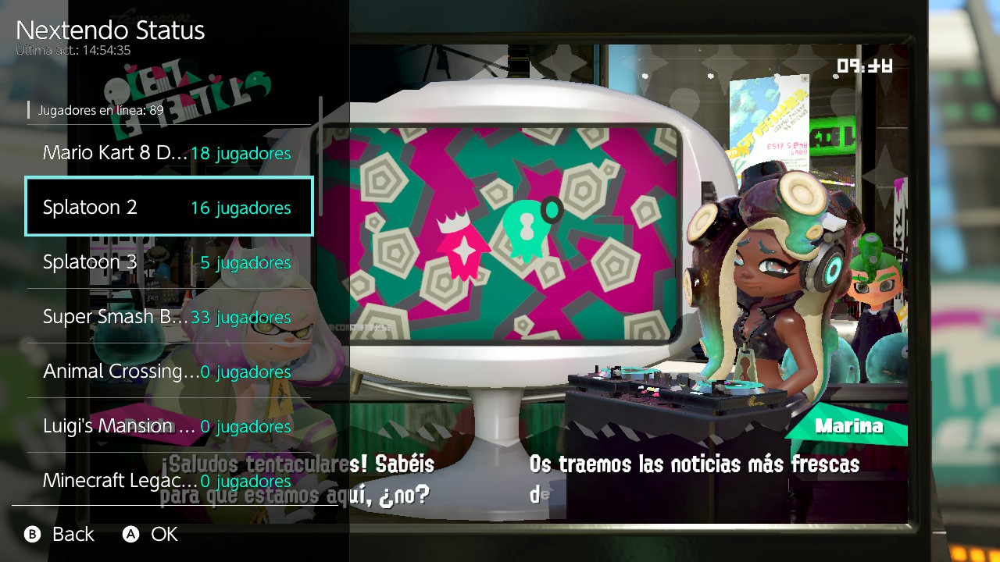
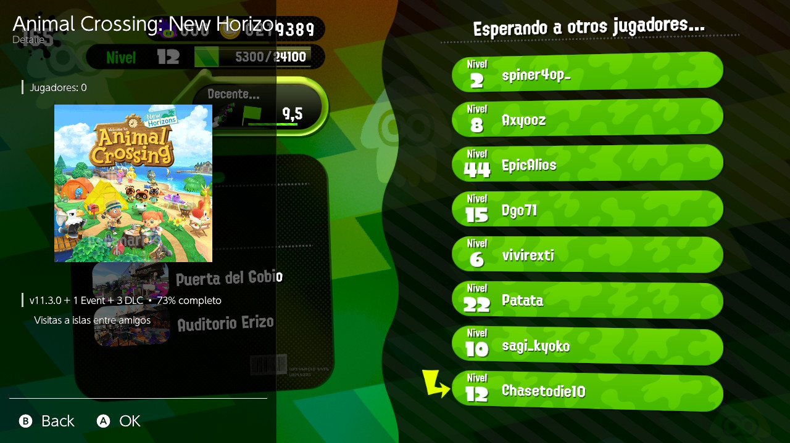
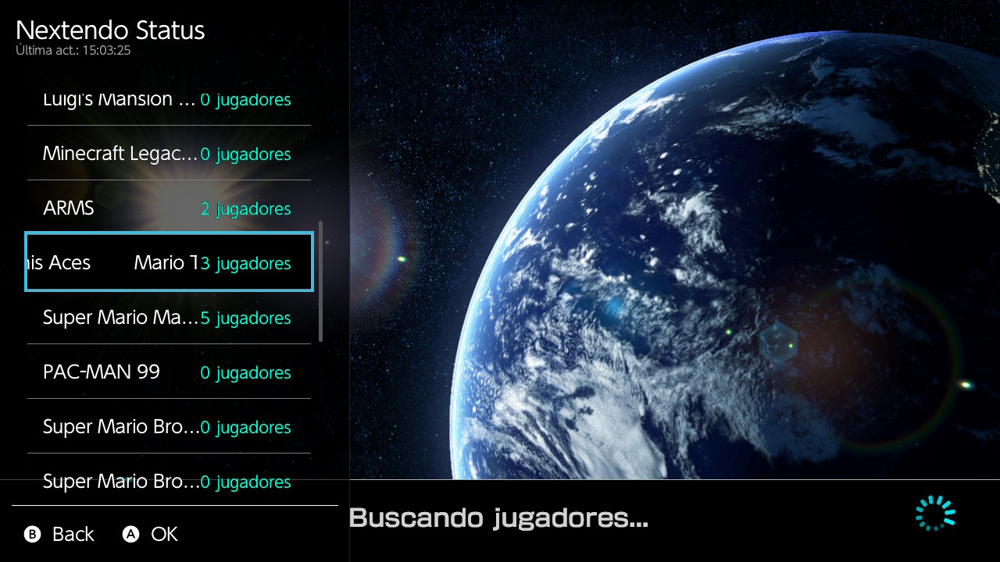
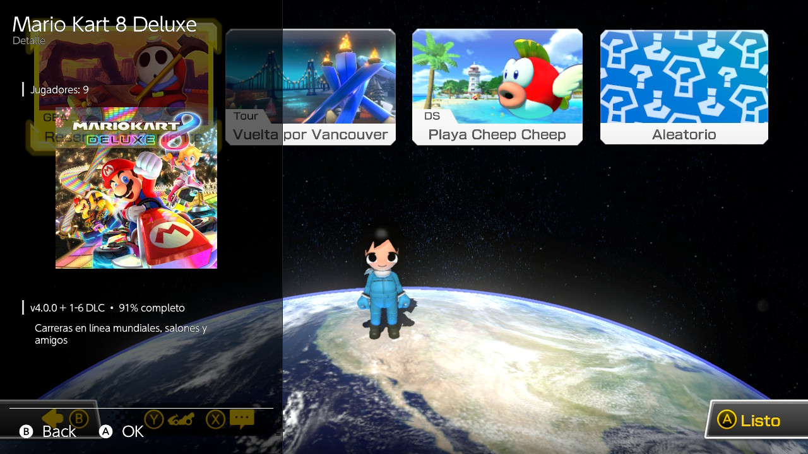

# Nextendo Status Overlay

Overlay para Nintendo Switch (Atmosphere + Tesla Menu / Ultrahand) que muestra en tiempo real cuántos jugadores hay conectados por juego en **Nextendo Network**, directamente en la consola — sin tener que revisar el sitio web o el teléfono.

## Características

- Lista de juegos con el conteo de jugadores en línea, actualizado automáticamente cada 15 segundos (solo mientras el overlay está abierto, para no gastar batería en segundo plano).
- Pantalla de detalle por juego: ícono, versión requerida, porcentaje de desarrollo, descripción y conteo de jugadores.
- Resumen del total de jugadores conectados en todos los juegos, visible de un vistazo.

## Capturas
 
<p float="left">
  
  
  
  
</p>

## Requisitos

- Nintendo Switch con **Atmosphere** (CFW) instalado.
- **Tesla Menu** o **Ultrahand Overlay** (cualquiera de los dos sirve como loader de overlays).

## Instalación

1. Descarga el `.ovl` más reciente.
2. Cópialo a la carpeta `/switch/.overlays/` de tu tarjeta SD.
3. Abre el menú de overlays con **L + D-Pad abajo** (o el combo que tengas configurado) y selecciona **Nextendo Status**.

## Compilar desde el código fuente

### Requisitos del entorno
- [devkitPro](https://devkitpro.org/) con **devkitA64** y **switch-dev** instalados.
- Paquetes de red/datos vía `pacman`:
  ```
  pacman -S devkitA64 switch-dev switch-curl switch-mbedtls switch-jansson git make
  ```
- [libtesla](https://github.com/WerWolv/libtesla) (incluida como submódulo del template).

### Pasos

```bash
git clone --recursive <url-de-este-repo>
cd nextendo-status-overlay
make
```

El `.ovl` resultante queda en la raíz del proyecto — cópialo a `/switch/.overlays/` en tu SD.

## Formato de `games.json`

El overlay descarga la lista de juegos desde `assets/data/games.json`. Cada entrada acepta:

```json
{
  "games": [
    {
      "name": "Splatoon 3",
      "ids": ["0100c2500fc20000"],
      "icon": "splatoon3",
      "version": "1.0.0",
      "percent": 78,
      "status": "Partidas en línea, salas privadas, Salmon Run y festivales"
    }
  ]
}
```

| Campo | Obligatorio | Descripción |
|---|---|---|
| `name` | Sí | Nombre mostrado en la lista. |
| `ids` | Sí | Title ID(s) de Nintendo Switch asociados al juego. Varios IDs (ej. por región) se combinan en uno solo, tomando el mayor conteo. |
| `icon` | No | Slug del ícono (sin `.bin`). Debe existir el archivo `assets/images/<slug>.bin` — ver abajo cómo generarlo. Déjalo vacío (`""`) si el juego no tiene ícono. |
| `version` | No | Versión de juego/DLC requerida. |
| `percent` | No | Porcentaje de desarrollo/compatibilidad (0-100). |
| `status` | No | Descripción libre de qué funciona en línea. |

Los cambios al `games.json` se reflejan la próxima vez que se **abre** el overlay (no en caliente mientras ya está abierto).

## Generar íconos

Los íconos se guardan como bytes RGBA crudos (no PNG), listos para dibujarse directo en pantalla. Para convertir un PNG:

```bash
pip install Pillow
python tools/convert_icon.py entrada.png assets/images/nombre.bin
```

El tamaño usado actualmente es **256×256** píxeles — si cambias el tamaño en el script, también hay que ajustarlo en el código del overlay (`main.cpp`, en `GuiGameDetail`).

## Créditos

- [WerWolv](https://github.com/WerWolv) — [libtesla](https://github.com/WerWolv/libtesla) y [Tesla-Template](https://github.com/WerWolv/Tesla-Template).
- [Nextendo Network](https://nextendo.network) — por la API de estado de jugadores.
- devkitPro — toolchain de desarrollo homebrew para Switch.

## Aviso

Este proyecto es un cliente no oficial y no está afiliado a Nintendo ni a Nextendo Network. Requiere una consola con software personalizado (CFW) y no se distribuyen aquí herramientas para obtenerlo.